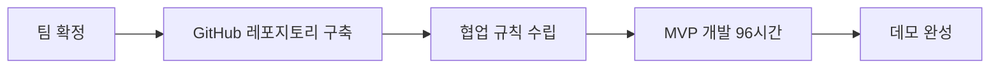

# 🎬 리워치 (Rewatch)

<div align="center">

### 영상 속 원하는 순간을 AI가 찾아주는 RAG 기반 학습 & 복습 플랫폼


</div>

---

## 📋 Table of Contents

- [소개 (Introduction)](#-소개-introduction)
- [기술 스택 (Tech Stack)](#-기술-스택-tech-stack)
- [개발 방법론 (Methodology)](#-개발-방법론-methodology)
- [주요 기능 (Key Features)](#-주요-기능-key-features)
- [결과 (Results)](#-결과-results)
- [한계점 및 향후 계획 (Discussion)](#-한계점-및-향후-계획-discussion)

---

## 🎯 소개 (Introduction)

**리워치(Rewatch)**는 BUILDERTHON2026에서 개발한 **RAG(Retrieval-Augmented Generation)** 기반 AI 플랫폼으로, 영상 콘텐츠를 활용한 학습과 업무 효율성을 혁신적으로 개선합니다.

### 🔍 해결하고자 하는 문제

영상 콘텐츠는 교육과 업무에서 필수적인 도구로 자리 잡았지만, 다음과 같은 비효율성이 존재합니다:

- ⏱️ **시간 낭비**: 특정 정보를 찾기 위해 긴 영상을 반복 시청
- 🎓 **학습 비효율**: 패스트캠퍼스 등 온라인 강의에서 특정 스킬 확인을 위한 되감기 반복
- 🏢 **업무 지연**: 기업 매뉴얼 영상의 특정 절차 재확인에 소요되는 시간
- ❌ **신뢰도 문제**: AI 챗봇의 환각(hallucination) 현상으로 인한 낮은 신뢰도

### 💡 솔루션

리워치는 영상 내 특정 정보에 **즉시 접근**하고, 이를 **체계적으로 복습·저장**할 수 있는 혁신적인 솔루션을 제공합니다.

> 📦 **MVP 개발 기간**: 96시간  
> 🎯 **목표**: AI 기술을 활용한 사용자 경험 혁신

---

## 🛠️ 기술 스택 (Tech Stack)

### AI & Machine Learning


- **GPT-4o**: 사용자 질문 의도 파악 및 컨텍스트 기반 답변 생성
- **OpenAI Whisper**: 오디오-텍스트 변환 (타임스탬프 포함)
- **text-embedding-3**: 시맨틱 검색을 위한 벡터 임베딩

### Backend & Database


- **Node.js**: 서비스 로직 처리 및 API 연동
- **Supabase (PostgreSQL + pgvector)**: 벡터 데이터베이스
- **match_documents 함수**: 고성능 시맨틱 검색 엔진

### Frontend


- **Next.js**: 안정적인 웹 애플리케이션 프레임워크
- **TypeScript**: 타입 안정성 보장
- **TailwindCSS**: 반응형 UI/UX 구현

### Video Processing


- **yt-dlc**: YouTube 영상 MP3 추출

---

## ⚙️ 개발 방법론 (Methodology)

### 📅 개발 프로세스



### 🔄 RAG Pipeline Architecture

```mermaid
flowchart TD
    A[YouTube Video URL] --> B[Download MP3 file]
    B --> C[OpenAI Whisper]
    C --> D[Transcription with timestamps]
    D --> E[Chunk text with timestamps]
    E --> F[OpenAI text-embedding-3]

    User[User] -->|provides URL| A
    User -->|asks question| Q[User Query]

    Q --> G[OpenAI text-embedding-3<br>→ query embedding]
    Q --> H[PostgreSQL / Supabase]

    F --> I[(Supabase Database<br>table: documents<br>columns:<br>• content<br>• metadata<br>• embedding [vector])]

    G --> H

    H --> K[match_documents<br>vector similarity search]
    K --> L[retrieveContext<br>→ relevant chunks]

    L --> M[Prompt Engineering]
    M --> N[OpenAI GPT-4o]

    N -->|generates answer| User

    subgraph "Ingestion Pipeline"
        A --> B --> C --> D --> E --> F --> I
    end

    subgraph "Query & RAG Pipeline"
        Q --> G & H --> K --> L --> M --> N --> User
    end

    style User fill:#f9f,stroke:#333,stroke-width:2px
    style GPT4o fill:#a8d,stroke:#333
```

```
┌─────────────────┐
│  YouTube Video  │
└────────┬────────┘
         │
         ▼
┌─────────────────┐
│   yt-dlc (MP3)  │
└────────┬────────┘
         │
         ▼
┌─────────────────┐
│ Whisper (STT)   │
│ + Timestamp     │
└────────┬────────┘
         │
         ▼
┌─────────────────┐
│  Text Chunking  │
│  (Word-based)   │
└────────┬────────┘
         │
         ▼
┌─────────────────┐
│   Embeddings    │
│ (text-embed-3)  │
└────────┬────────┘
         │
         ▼
┌─────────────────┐
│ Vector Database │
│   (Supabase)    │
└────────┬────────┘
         │
         ▼
┌─────────────────┐
│ Semantic Search │
│   + GPT-4o      │
└─────────────────┘
```

### 🎯 핵심 기술적 챌린지 및 해결 방법

| 챌린지 | 해결 방법 |
|--------|-----------|
| 비정형 데이터 검색 | 영상 → 오디오 → 텍스트 변환 후 청킹 알고리즘 적용 |
| 검색 정확도 향상 | 키워드 검색 대신 **시맨틱 검색** 도입 |
| AI 환각 문제 | 프롬프트 엔지니어링으로 영상 콘텐츠 기반 답변 제한 |
| 문맥 유사성 파악 | 벡터 임베딩으로 "상태 관리" ≈ "데이터 흐름 제어" 매칭 |

### 🔬 시맨틱 검색 예시

```
사용자 질문: "상태 관리는 어떻게 하나요?"
           ↓
영상 내용: "데이터 흐름 제어 방법은..."
           ↓
결과: ✅ 문맥 유사성 계산으로 정확한 구간 추출
```

---

## 🚀 주요 기능 (Key Features)

### 1️⃣ AI 챗봇 기반 영상 검색

- 💬 사용자 질문에 대한 즉각적인 답변
- 🎯 타임스탬프 기반 정확한 영상 구간 제공
- ✅ 원본 영상으로 답변 검증 가능

### 2️⃣ 복습공간 (Review Space)

- 📝 모든 질문-답변 자동 저장
- ⏰ 타임스탬프와 함께 개인 맞춤형 학습 노트 생성
- 🔄 저장된 구간만 선택적으로 재학습 가능

### 3️⃣ 사용자 워크플로우

```
1. 💬 AI 챗봇에 질문
        ↓
2. 📍 답변 + 타임스탬프 확인
        ↓
3. ▶️ 해당 구간 즉시 재생
        ↓
4. 💾 복습공간에 자동 저장
        ↓
5. 🔁 저장된 구간만 재학습
```

---

## 📊 결과 (Results)

### ✅ MVP 달성 목표

- [x] 기본 RAG 파이프라인 구축
- [x] 타임스탬프 기반 영상 검색 기능
- [x] 복습공간 자동 저장 기능
- [x] 반응형 웹 UI/UX 완성
- [x] GitHub 소스 코드 및 문서 공개

### 📈 효과

- ⚡ **영상 학습 시간 단축**: 반복 시청 불필요
- 🎯 **정확한 정보 접근**: 타임스탬프 기반 즉시 탐색
- 📚 **체계적인 복습**: 개인 맞춤형 학습 노트 자동 생성
- ✅ **신뢰도 향상**: 원본 영상으로 AI 답변 검증

### 🎓 활용 사례

> **패스트캠퍼스 수강생**  
> "React Hooks 사용법"을 질문하면, 해당 설명 구간의 타임스탬프와 함께 답변을 받아 즉시 확인 가능

> **기업 교육 담당자**  
> 업무 매뉴얼 영상에서 "결재 승인 절차"를 검색하여 신입 사원에게 정확한 구간 공유

---

## 🔮 한계점 및 향후 계획 (Discussion)

### ⚠️ 현재 한계점

| 한계점 | 설명 |
|--------|------|
| 🐌 처리 속도 | Whisper + Embedding 모델의 긴 처리 시간 |
| 📹 지원 범위 | 대규모 영상 및 실시간 스트리밍 미지원 |
| 🌐 소셜 기능 | 동일 코스 수강생 간 질문 공유 기능 미구현 |
| 🔍 검색 정확도 | 복잡한 문맥 및 다국어 영상에서 오류 발생 가능 |
| 📊 스케일링 | 벡터 데이터베이스 최적화 부족 |

### 🚀 향후 발전 방향

#### 1. 성능 최적화
- ☁️ 클라우드 기반 GPU 가속 도입
- 🔧 문장 수준 청킹 알고리즘 적용
- ⚡ 병렬 처리 파이프라인 구축

#### 2. 기능 확장
- 👥 **소셜 기능**: 커뮤니티 기반 집단 지식 활용
- 🎬 **다중 소스 지원**: Vimeo, Coursera 등 추가
- 📱 **모바일 앱**: iOS/Android 네이티브 앱 개발
- 🖼️ **멀티모달 AI**: GPT-4V 통합으로 영상 프레임 분석

#### 3. AI 정확도 향상
- 🎯 환각 문제 해결을 위한 검증 레이어 추가
- 🌍 다국어 지원 강화
- 📊 사용자 피드백 기반 모델 파인튜닝

---

<div align="center">

### 🌟 비전

**리워치는 교육과 업무 분야에서 AI 기반 영상 학습의 표준 솔루션이 될 잠재력을 지니고 있습니다.**

---

Made with ❤️ by BUILDERTHON2026 Team | [GitHub Repository](https://github.com) | [Demo](https://demo.link)

[](https://github.com)
[](https://github.com)

</div>
